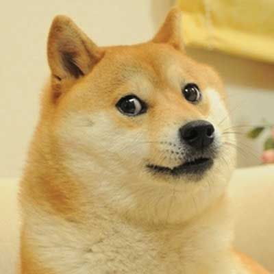

= Demo Presentation
:revealjs_theme: solarized
:customcss: assets/custom.css

== local image

include::assets/base_example.adoc[]
include::assets/content1.adoc[]
include::assets/content2.adoc[]
include::assets/content3.adoc[]
